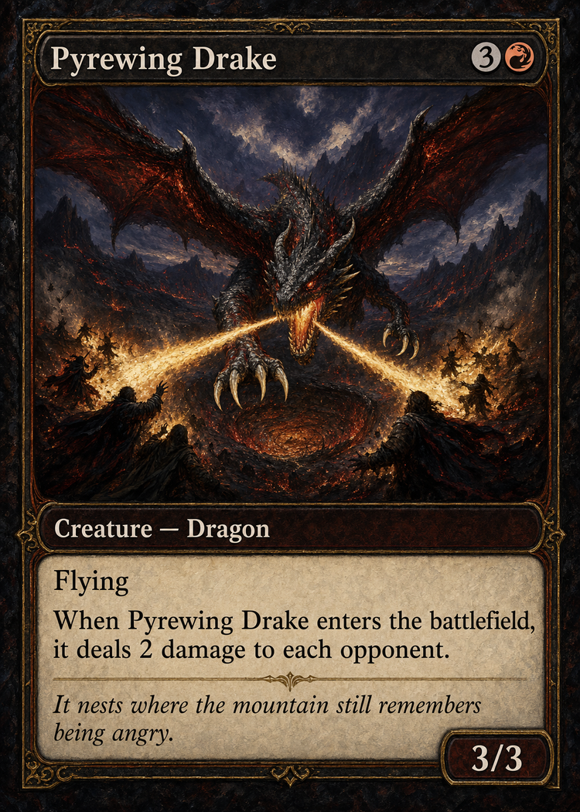
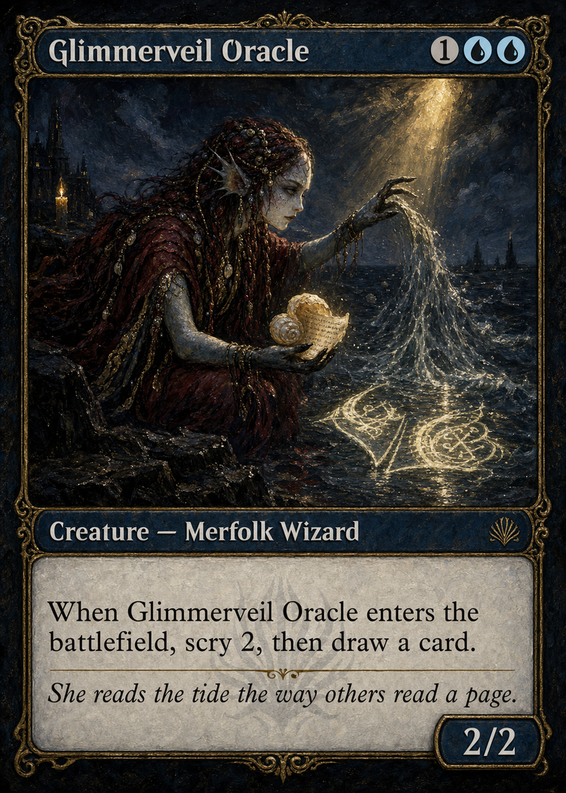
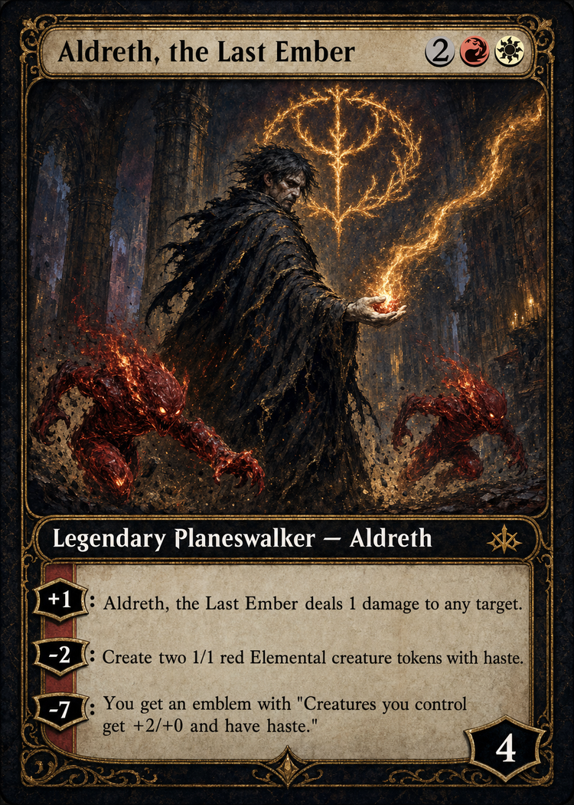

<div align="center">


# MTGArt

**Card names in, print-ready proxies out, every card in one locked style at 300 DPI**

[](LICENSE)


</div>

---

Point it at a list of card names and it hands you back a stack of cards so pretty
they look like they fell out of a booster pack from a parallel universe where the
art director actually gave a shit. It is a small, unreasonably talented factory
that turns the sentence "I wish this card looked like a Rembrandt" into an actual
300 DPI Rembrandt, and then charges you nineteen cents for the privilege.

It is also a cautionary tale about intellectual property, but we will get to that
once you are done gawking.

<p align="center">
  
  
  
</p>

<p align="center"><em>Three cards that do not exist, invented on the spot and rendered start to finish in one locked style by this thing. It is a rendering engine, not a photocopier, a distinction its lawyer would very much like entered into the record.</em></p>

## What it actually does

1. You paste some card names.
2. It asks Scryfall what those cards actually are, because it does not guess and
   it does not lie, which already makes it more trustworthy than most of the
   internet.
3. An AI art director reads each card's rules and writes a scene description so
   purple and overwrought it could get tenure in a creative writing program.
4. gpt-image-2 paints the whole damn card in one locked style you pick, so a
   sixty-card set looks like one artist made it over a single feverish weekend
   instead of forty strangers who have never met.
5. sharp slices the result into print-ready proxies at true card size, with
   bleed, at 300 DPI, so your home printer is out of excuses.
6. You hit "Download all" and go feed a printer whose legal exposure is entirely
   your problem and none of ours.

## Features that exist and, against all odds, actually work

- **One master style prompt** rules every card, so your set looks like a set and
  not a twelve-car pileup of clashing nonsense assembled in the dark.
- **The whole card ships as XML.** Titles, type lines, rules, loyalty abilities,
  mana pips, all of it. The model reads it like a spec sheet, which is the only
  reason a two-generic pip is finally one circle with a "2" in it, instead of,
  as it was during a genuinely humiliating chapter of this project, two panicked
  little "1" circles standing next to each other like they had just met at a
  funeral.
- **The text box does not shit itself under load.** Hand it a planeswalker with
  four loyalty abilities and it lays them out in tidy rows instead of a ransom
  note.

<p align="center">
  
</p>

- **Print pipeline** spits out screen, trim, and bleed PNGs plus a per-card PDF.
- **Full send mode:** a big red button for when it is payday and a spend cap feels
  like a personal attack. It fires every card at once up to your API limit and
  ignores the cap completely. Use it responsibly, or do not. It is your money and
  your regrets.

## Running it

You will need:

- Node 18+ (built on 22, happier there).
- An OpenAI API key with image-generation access. Set `OPENAI_API_KEY`.
- Roughly nineteen cents per high-quality card, a number that becomes a real
  problem the instant you think "let me just try one more style."

```
cp .env.local.example .env.local    # then paste your key
npm install
npm run dev                          # http://localhost:3000
```

One card from the terminal, for science:

```
npm run generate:one -- "Lightning Bolt" dark-oil
```

## A serious word, and this one is not a bit

Everything above is a joke. The next few paragraphs are not, so wipe the grin off
and read them.

This software generates images that reproduce the card names, rules text, mana
symbols, and card frame of Magic: The Gathering. Every one of those belongs to
Wizards of the Coast. This is a personal art and playtesting toy. It is not
affiliated with, endorsed by, or within a country mile of Wizards of the Coast,
and it never will be.

Wizards owns that stuff and they are not fucking around about protecting it.
Free, non-commercial tools that did basically what this one does have eaten
cease-and-desist letters and vanished inside of two weeks. This project can go
the exact same way, on any given Tuesday, with no warning and no appeal. If it is
still here when you read this, treat that as luck, not a promise.

So do not be stupid with it:

- Use it for personal, non-commercial shit only. Cards for your kitchen table,
  your pod, your own dumb amusement. That is the lane. Stay in it.
- **Do not, under any circumstances, build a money-making business on top of
  this.** Selling the cards, selling prints of them, or charging anyone a single
  dime to use a service that makes them is the fastest known way to turn a fun
  weekend project into a letter from a law firm and a frozen payment account. We
  are telling you this as a favor, not as decoration.
- This is not legal advice. If you are seriously weighing anything commercial, go
  pay a real intellectual-property attorney for an hour of their time before you
  do a single thing, not after the letter shows up.

Govern yourself accordingly. We will not be sending flowers.

## License

Copyright 2026 Locke Werks. Licensed under the GNU General Public License v3.0.
See `LICENSE` for the full text. It went open source because the other timeline
had a courtroom in it, and this one just has you scrolling past a very long legal
document you are absolutely not going to read.
